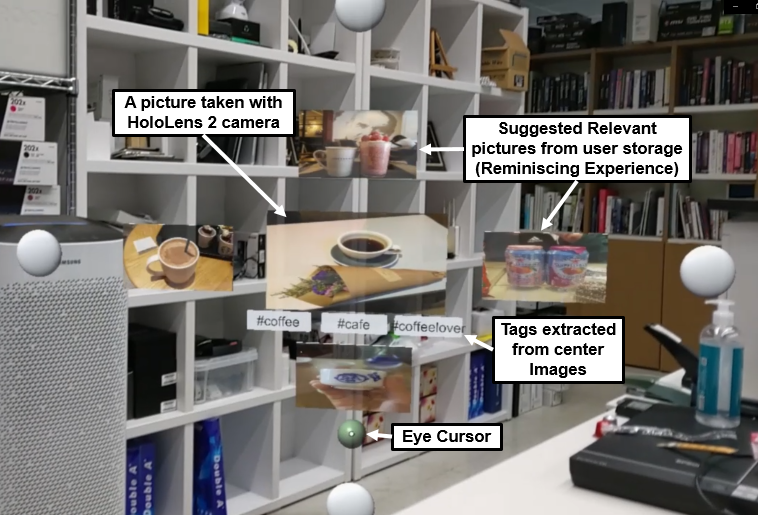

## SuggestBot: Development of a Context-Based Smart Interaction Service Platform 
<h4 align="center">
 (R&D Project funded by Korea Ministry of Science and ICT - Project Demonstration, <a href="https://hcil.kaist.ac.kr/">HCI Lab KAIST</a>, 2020)
</h4>
<p align="center">
    
</p>

## Development Environment
* AR Headset: [Hololens 2](https://www.microsoft.com/ko-kr/hololens/hardware)
* [MRTK-Unity](https://docs.microsoft.com/ko-kr/windows/mixed-reality/mrtk-unity) (Mixed Reality Toolkit) API for Hololens Programming
* Unity Version:  2020.3.23f1
## Prerequisites 
* HoloLens 2 fundamentals: develop mixed reality applications
  * [Introduction to Mixed Reality Toolkit](https://docs.microsoft.com/ko-kr/learn/modules/learn-mrtk-tutorials/1-1-introduction)

## Access to Real-Time Eye Gaze (MRTK-Unity API)
```C#
using Microsoft.MixedReality.Toolkit;

Vector3 gazeDir = CoreServices.InputSystem.EyeGazeProvider.GazeDirection;
Vector3 gazeOrigin = CoreServices.InputSystem.EyeGazeProvider.GazeOrigin;

Ray gazeRay = new Ray(gazeOrigin, gazeDir);    // Eye Gaze ray 
GameObject.Find("EyeCursor").transform.position = gazeRay.GetPoint(15.0f);   // Locate eye cursor
```

## Voice Input 
[Microsoft Docs - Voice input in Unity](https://docs.microsoft.com/en-us/windows/mixed-reality/develop/unity/voice-input-in-unity)

```C#
using UnityEngine.Windows.Speech;
using System.Collections.Generic;
using System.Linq;

KeywordRecognizer keywordRecognizer;
delegate void KeywordAction(PhraseRecognizedEventArgs args);
Dictionary<string, KeywordAction> keywordCollection;

void Start()
{
  keywordCollection = new Dictionary<string, KeywordAction>();
  keywordCollection.Add("Take Picture", TakePicture);
  keywordRecognizer = new KeywordRecognizer(keywordCollection.Keys.ToArray());
  keywordRecognizer.OnPhraseRecognized += KeywordRecognizer_OnPhraseRecognized;
  keywordRecognizer.Start();
}
```

## Access to Built-In Front Camera of Hololens
[Microsoft Docs - Photo Video camera in Unity](https://docs.microsoft.com/en-us/windows/mixed-reality/develop/unity/locatable-camera-in-unity)
```C#
void TakePicture(PhraseRecognizedEventArgs prea)
{
  PhotoCapture.CreateAsync(false, OnPhotoCaptureCreated);
}

void OnPhotoCaptureCreated(PhotoCapture captureObject)
{
  photoCaptureObject = captureObject;
  ...
  captureObject.StartPhotoModeAsync(c, OnPhotoModeStarted);
}

void OnPhotoModeStarted(PhotoCapture.PhotoCaptureResult result)
{
  if (result.success)
    photoCaptureObject.TakePhotoAsync(OnCapturedPhotoToMemory);
  else
    Debug.LogError("Unable to start photo mode ...");
}

void OnCapturedPhotoToMemory(PhotoCapture.PhotoCaptureResult result, PhotoCaptureFrame photoCaptureFrame)
{
  if (result.success)
  {
    ...
  }
  photoCaptureObject.StopPhotoModeAsync(OnStoppedPhotoMode);
}

void OnStoppedPhotoMode(PhotoCapture.PhotoCaptureResult result)
{
  photoCaptureObject.Dispose();
  photoCaptureObject = null;
}
```
